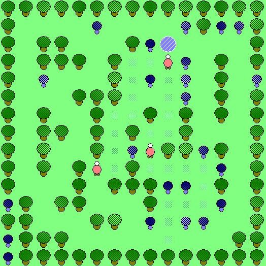
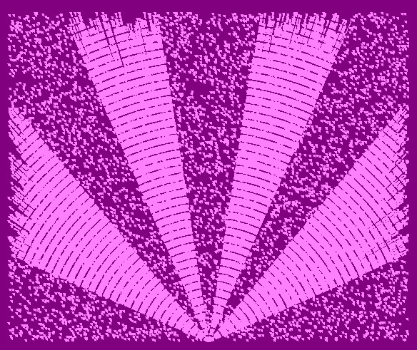
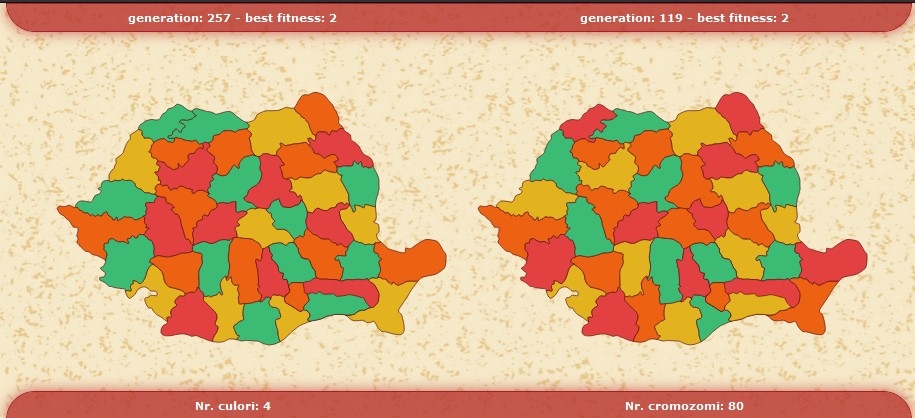
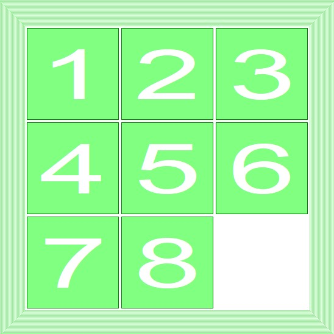
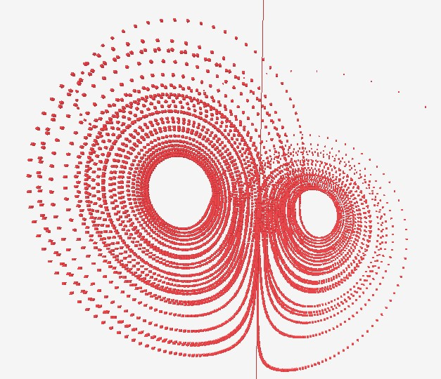
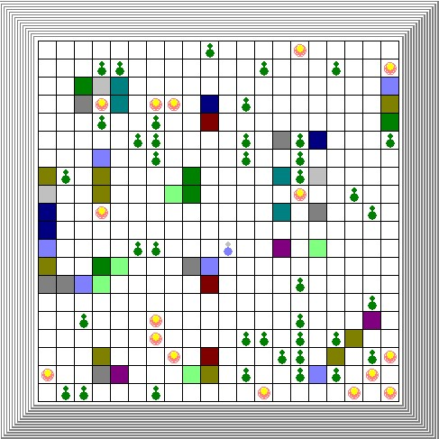

# UniProjects
Projects built for the labs in University.

### Creier de Furnica 
Visualization of Ant Colony Algorithm for finding optimal paths using c++ & `graphics.h`.

### Disco
Visualization of 8200 random points and lines connecting them using c++ & `graphics.h`.

### Map Coloring with Genetic Algorithm
Visualization of the Map-colouring problem using `raphael.js`.

### Puzzle 8
Self-solving Greedy solution for a 3x3 sliding puzzle using c++ & `graphics.h`.

### RungeKutta
Visualization of The Lorenz Attractor using `three.js`.

### Wumbus
Visualization of an agent taking random actions in an environment using c++ & `graphics.h`.

